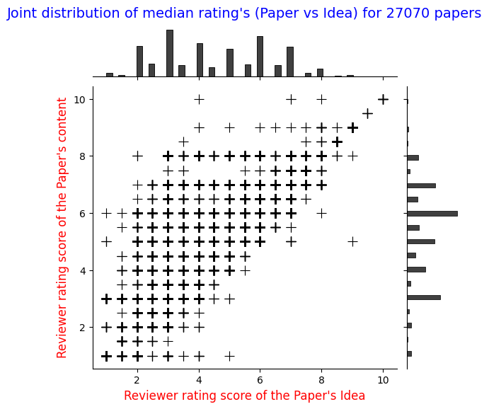

# LMRSD (Learning meaningful rewards on Scientific Documents)


> AI Reviews are becoming more and more common. How does this affect our conferences? Image created with DALL-E
> Source: https://akmaier.medium.com/ai-on-review-how-large-language-models-are-reshaping-peer-review-ac475fcf539e

### Title
Pre-review to Peer review | Pitfalls of Automating Reviews using Large Language Models

### Abstract
Large Language Models are versatile general-task solvers, and their capabilities can truly assist people with scholarly peer review as $\textit{pre-review}$ agents, if not as fully autonomous $\textit{peer-review}$ agents. While incredibly beneficial, automating academic peer-review, as a concept, raises concerns surrounding safety, research integrity, and the validity of the academic peer-review process. The majority of the studies performing a systematic evaluation of frontier LLMs generating reviews across science disciplines miss the mark on addressing the alignment/misalignment of reviews along with the utility of LLM generated reviews when compared against publication outcomes such as $\textbf{Citations}$, $\textbf{Hit-papers}$, $\textbf{Novelty}$, and $\textbf{Disruption}$. This paper presents an experimental study in which we gathered ground-truth reviewer ratings from OpenReview and used various frontier open-weight LLMs to generate reviews of papers to gauge the safety and reliability of incorporating LLMs into the scientific review pipeline. Our findings demonstrate the utility of frontier open-weight LLMs as pre-review screening agents despite highlighting fundamental misalignment risks when deployed as autonomous reviewers. Our results show that all models exhibit weak correlation with human peer reviewers (0.15), with systematic overestimation bias of 3-5 points and uniformly high confidence scores (8.0-9.0/10) despite prediction errors. However, we also observed that LLM reviews correlate more strongly with post-publication metrics than with human scores, suggesting potential utility as pre-review screening tools. Our findings highlight the potential and address the pitfalls of automating peer reviews with language models. We open-sourced our dataset $D_{LMRSD}$ to help the research community expand the safety framework of automating scientific reviews.

### Core motivation
- Using Language models in scholarly peer review seems comes with significant risks surrounding safety, research integrity and validity of the review.
- Inevitably people utilize LLMs as pre-review agents if not fully autonomous peer-review agents.
- Lack of a systematic evaluation of LLMs generating reviews across science disciplines misses the mark on and assessing the alignment/misalignment question.

### Research Agenda
- Part 1: Assess and review the ideas presented in a scientific article just using the abstract
	- TuluV3 
	- Nemotron-49b-1.5 
	- Qwen3-32b 
	- Llama3.3-70b 
	- Gemma3-27b 
	- NOTE : Models that are open-weight, SOTA, and fit the context window (> 32k) of full-text were the reason for selection
- Part 2: Assess and review the ideas and fully review the scientific article using the full-text
	- Part A: Using Dense Models
		- TuluV3 
		- Nemotron-49b-1.5 
		- Qwen3-32b 
		- Llama3.3-70b 
		- Gemma3-27b 
	- Part B: Using Reasoning Models
		- Distill R1-llama-70b 
		- Qwen/Qwen3-Next-80B-A3B-Thinking 
		- GPT-OSS-20b 
		- GPT-OSS-120b 
	- NOTE : Models that are open-weight, SOTA, and fit the context window (> 32k) of full-text were the reason for selection
- Part 3: Create Post publications outcomes dataset that captures. 
- Part 4: Correlations and statistical analysis of LLM generated peer-review scores against post-publication outcomes like C5 (citations up-until 5 years), Novelty, Disruption and Hit papers.
- Ablation 1: Effect of instructions in Dense over alignment of review scores.
- Ablation 2: Effect of reasoning strength in arguing merits of peer review for reasoning models.
- Discussion: Alignment vs Misalignment of ground truth, a case study.

### Data


More about the data can be found [here](./data/README.md).
> `NOTE`: The datasets are available as parquet files on Google drive, and they can be found [here](https://drive.google.com/drive/folders/1nAPX7PFgCbhGVaHMhkMqbak9dCg4WxfL?usp=sharing).

### Repository structure

```shell
├── LICENSE
├── README.md
├── data
│   ├── README.md
│   ├── __init__.py
│   └── media
│       ├── review_idea_distribution.png
│       ├── review_joint_distribution.png
│       └── review_paper_distribution.png
└── src
    ├── __init__.py
    ├── icl.py
    ├── prompts.py
    └── schema.py
```

### Environment setup

Install [uv](https://docs.astral.sh/uv/getting-started/installation/)
```shell
curl -LsSf https://astral.sh/uv/install.sh | sh
```

or via **pip**
```shell
pip install uv
```

Have the following packages installed to run `LMRSD`
```shell
uv pip install torch --index-url https://download.pytorch.org/whl/cu128
uv pip install bitsandbytes
uv pip install git+https://github.com/huggingface/transformers
uv pip install deepspeed
uv pip install sentencepiece
uv pip install vllm tiktoken outlines trl openai polars peft tqdm pydantic google-genai matplotlib scikit-learn ninja bs4
```

### Acknowledgement
Thanks to `@sumuks` and the huggingface repo **[sumuks/openreview-reviews-filtered](https://huggingface.co/datasets/sumuks/openreview-reviews-filtered)** which were crucial for the dataset, experiments, and meethodology of the paper.

### License
[MIT License](https://github.com/akhilpandey95/LMRSD/blob/main/LICENSE)

### Authors and Collaborators
[Akhil Pandey](https://github.com/akhilpandey95)
