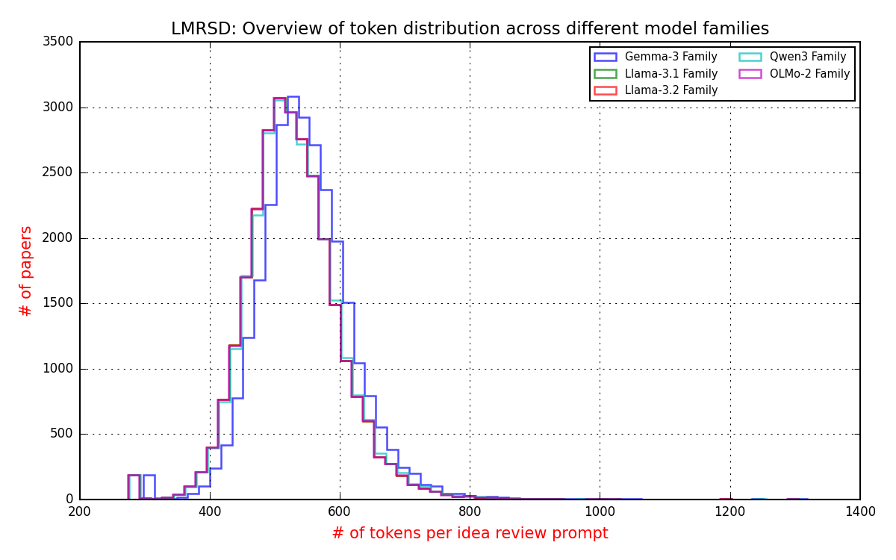
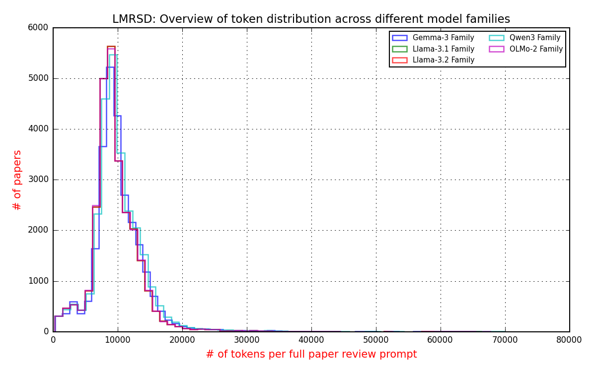

### Data:


### Token distribution overlay across different LM model families




### Statistics about the dataset
**Table 1: Count distribution of reviewer ratings for the paper**
```plaintext
┌─────────────────────┬─────────────┐
│ review_rating_score ┆ # of papers │
│ ---                 ┆ ---         │
│ f64                 ┆ u32         │
╞═════════════════════╪═════════════╡
│ 6.0                 ┆ 19307       │
│ 3.0                 ┆ 13767       │
│ 5.0                 ┆ 12444       │
│ 7.0                 ┆ 10668       │
│ 8.0                 ┆ 7304        │
│ 4.0                 ┆ 6204        │
│ 2.0                 ┆ 2009        │
│ 1.0                 ┆ 1704        │
│ 9.0                 ┆ 817         │
│ 10.0                ┆ 198         │
│ 0.0                 ┆ 11          │
│ -2.0                ┆ 5           │
└─────────────────────┴─────────────┘
```

**Table 2: Count distribution of reviewer ratings for the idea of the paper**
```plaintext
┌───────────────────────────────┬─────────────┐
│ idea_only_review_rating_score ┆ # of papers │
│ ---                           ┆ ---         │
│ f64                           ┆ u32         │
╞═══════════════════════════════╪═════════════╡
│ 3.0                           ┆ 14671       │
│ 6.0                           ┆ 11913       │
│ 2.0                           ┆ 11816       │
│ 4.0                           ┆ 10500       │
│ 7.0                           ┆ 9993        │
│ 5.0                           ┆ 8274        │
│ 8.0                           ┆ 4725        │
│ 1.0                           ┆ 1623        │
│ 9.0                           ┆ 758         │
│ 10.0                          ┆ 153         │
│ 0.0                           ┆ 8           │
│ -2.0                          ┆ 4           │
└───────────────────────────────┴─────────────┘
```

All of the datapoints in **Table 1**, and **Table 2** look legitimate, except for
**-2.0**, and **0.0**. There could be a legitimate reason for **0.0** but for the
sake of simplicity, its better to remove them from the final experiments, and analysis.

**Table 3: Count distribution of reviewer rating confidence for the paper**
```plaintext
┌─────────────────────────┬─────────────┐
│ review_confidence_score ┆ # of papers │
│ ---                     ┆ ---         │
│ f64                     ┆ u32         │
╞═════════════════════════╪═════════════╡
│ 4.0                     ┆ 35556       │
│ 3.0                     ┆ 22647       │
│ 5.0                     ┆ 9677        │
│ 2.0                     ┆ 5503        │
│ 1.0                     ┆ 680         │
│ 6.0                     ┆ 333         │
│ 8.0                     ┆ 40          │
│ 100.0                   ┆ 1           │
│ 0.0                     ┆ 1           │
└─────────────────────────┴─────────────┘
```

**Table 4: Count distribution of reviewer rating confidence for the idea of the paper**
```plaintext
┌─────────────────────────┬─────────────┐
│ review_confidence_score ┆ # of papers │
│ ---                     ┆ ---         │
│ f64                     ┆ u32         │
╞═════════════════════════╪═════════════╡
│ 4.0                     ┆ 35556       │
│ 3.0                     ┆ 22647       │
│ 5.0                     ┆ 9677        │
│ 2.0                     ┆ 5503        │
│ 1.0                     ┆ 680         │
│ 6.0                     ┆ 333         │
│ 8.0                     ┆ 40          │
│ 100.0                   ┆ 1           │
│ 0.0                     ┆ 1           │
└─────────────────────────┴─────────────┘
```

When observing the values in **Table 3**, and **Table 4** we can notice **100.0**, and **0.0**
seem to be outlier conditions. For the sake of keeping the data clean, they're removed from the
final dataset.


**Table 5: Year wise breakdown of the papers**
```plaintext
┌──────┬─────────────┐
│ year ┆ # of papers │
│ ---  ┆ ---         │
│ str  ┆ u32         │
╞══════╪═════════════╡
│ 2022 ┆ 7945        │
│ 2021 ┆ 6942        │
│ 2023 ┆ 5761        │
│ 2020 ┆ 2241        │
│ 2019 ┆ 2197        │
│ 2018 ┆ 1363        │
│ 2017 ┆ 621         │
└──────┴─────────────┘
```

**Table 6: Venue composition of the papers**
```plaintext
┌─────────────────────────────────┬──────┬─────────────┐
│ venue                           ┆ year ┆ # of papers │
│ ---                             ┆ ---  ┆ ---         │
│ str                             ┆ str  ┆ u32         │
╞═════════════════════════════════╪══════╪═════════════╡
│ ICLR.cc/2023/Conference         ┆ 2023 ┆ 4903        │
│ ICLR.cc/2022/Conference         ┆ 2022 ┆ 3369        │
│ ICLR.cc/2021/Conference         ┆ 2021 ┆ 2975        │
│ NeurIPS.cc/2022/Conference      ┆ 2022 ┆ 2816        │
│ NeurIPS.cc/2021/Conference      ┆ 2021 ┆ 2754        │
│ ICLR.cc/2020/Conference         ┆ 2020 ┆ 1732        │
│ ICLR.cc/2019/Conference         ┆ 2019 ┆ 1555        │
│ ICLR.cc/2018/Conference         ┆ 2018 ┆ 980         │
│ ICLR.cc/2017/conference         ┆ 2017 ┆ 497         │
│ ICLR.cc/2018/Workshop           ┆ 2018 ┆ 264         │
│ auai.org/UAI/2022/Conference    ┆ 2022 ┆ 229         │
│ robot-learning.org/CoRL/2023/C… ┆ 2023 ┆ 197         │
│ robot-learning.org/CoRL/2022/C… ┆ 2022 ┆ 197         │
│ NeurIPS.cc/2022/Track/Datasets… ┆ 2022 ┆ 163         │
│ robot-learning.org/CoRL/2021/C… ┆ 2021 ┆ 153         │
│ NeurIPS.cc/2021/Track/Datasets… ┆ 2021 ┆ 144         │
│ MIDL.io/2020/Conference         ┆ 2020 ┆ 135         │
│ ICLR.cc/2017/workshop           ┆ 2017 ┆ 121         │
│ MIDL.io/2019/Conference         ┆ 2019 ┆ 117         │
│ MIDL.io/2023/Conference         ┆ 2023 ┆ 112         │
└─────────────────────────────────┴──────┴─────────────┘
```

### LMRSD dataset

Due to nulls in the full text within `lmrsd_ft_evaluation.parquet`, the entries were removed.
```plaintext
┌──────────┬─────────────┬───────────────┬─────────────────────┬────────────────────────┬────────────────────────┬───────────────────────────┐
│ paper_id ┆ paper_title ┆ paper_content ┆ avg_ft_rating_score ┆ median_ft_rating_score ┆ avg_ft_rating_score_cf ┆ median_ft_rating_score_cf │
│ ---      ┆ ---         ┆ ---           ┆ ---                 ┆ ---                    ┆ ---                    ┆ ---                       │
│ u32      ┆ u32         ┆ u32           ┆ u32                 ┆ u32                    ┆ u32                    ┆ u32                       │
╞══════════╪═════════════╪═══════════════╪═════════════════════╪════════════════════════╪════════════════════════╪═══════════════════════════╡
│ 0        ┆ 0           ┆ 149           ┆ 195                 ┆ 195                    ┆ 794                    ┆ 794                       │
└──────────┴─────────────┴───────────────┴─────────────────────┴────────────────────────┴────────────────────────┴───────────────────────────┘
```

**Acknowledgement**
Thanks to a public OpenReview reviews dataset hosted on Hugging Face, which was crucial for the dataset, experiments, and methodology of the paper.
